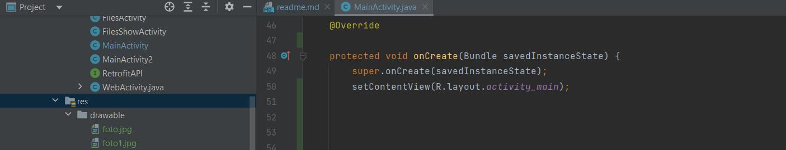

# PMU/142-148

этого атрибута должно быть имя метода, определенное операцией с помощью
меню. Этот метод должен быть общедоступным и принимать один параметр
_Menuitem_, - когда система вызывает этот метод, она передает ему выбранный
пункт меню.
## 5.3.3. Создание контекстного меню ##

В контекстное меню помещают команды, затрагивающие определенный элемент
пользовательского интерфейса. Контекстное меню можно создать для любого
представления, но чаще всего они используются для элементов из представлений
_ListView_, _GridView_ или других групп представлений, в которых пользователь может
выполнять действия непосредственно с каждым элементом.

Существуют два способа предоставления возможности контекстных действий:

* в плавающем контекстном меню. Меню отображается в виде плавающего списка
пунктов меню (вроде диалогового окна), когда пользователь длительно нажимaет
на экран (нажимает и удерживает нажатым) в представлении, которое объявляет
поддержку контекстного меню. Пользователи могут каждый раз выполнять
контекстное действие только с одним элементом;
* в режиме контекстных действий. Этот режим является системной реализацией
_ActionМode_, отображающей строку контекстных действий вверху экрана с пунктами
действий, которые затрагивают выбранные элементы. Когда этот режим
активен, пользователи могут одновременно выполнять действие с несколькими
элементами ( если это допускается приложением).

Начнем с создания плавающего контекстного меню. Прежде всего нужно зарегистрировать
класс _View_, с которым с помощью метода _registerForContextMenu()_ надо
связать контекстное меню, передав ему _View_. Если операция использует представления
_ListView_ или _GridView_ и требуется, чтобы каждый элемент предоставлял
одинаковое контекстное меню, зарегистрируйте все элементы для контекстного
меню, передав _ListView_ или _GridView_ методу _registerForContextMenu()_.

Далее нужно реализовать метод _onCreateContextMenu()_ в _Activity_ или _Fragment_.
Когда зарегистрированное представление примет событие длительного нажатия,
система вызовет ваш метод _onCreatecontextмenu()_. Именно здесь определяются
пункты меню. Делается это обычно путем загрузки ресурса меню:

```
@Override
pubic void onCreateContextMenu(ContextMenu menu, View v,ContextMenuinfo menuinfo){
super.onCreateContextMenu(menu, v, menuinfo);
Menuinflater inflater = getMenuinflater();
inflater.inflate(R.menu.context_menu, menu);
} 
```  

_Menuinflater_ позволяет загружать контекстное меню из ресурса меню.
Остается только реализовать метод _onContextitemSelected()_ для определения об
работчиков меню:

```
@Override
puЫic boolean onContextiternSelected(Menuitem item) {
AdapterContextMenuinfo info = (AdapterContextMenuinfo) item.getMenuinfo();
switch (item.getiternid()) {
case R.id.edit:
editNote(info.id);
return true;
case R.id.delete:
deleteNote(info.id);
return true;
default:
return super.onContextitemSelected(item);
  }
}
```
Теперь поговорим о режиме контекстных действий.Он представляет собой системную
реализацию класса _ActionМode_, которая ориентирует пользователя на выполнение
контекстных действий при eгo взаимодействии с приложением. Когда пользователь,
используя этот режим, выбирает элемент, вверху экрана открывается строка
контекстных действий, содержащая действия, которые пользователь может выполнить
с выбранными в настоящий момент элементами. В этом режиме пользователь
может выбирать несколько элементов ( если это допускается приложением), снимать
выделения с элементов и продолжать навигацию в операции (в тех пределах,
в которых это поддерживается приложением). Режим контекстных действий отключается,
а строка контекстных действий исчезает, когда пользователь снимет
выделение со всех элементов, нажмет кнопку **Back** или выберет действие **Done**,
расположенное слева.

Чтобы создать такое контекстное меmо, нужно реализовать интерфейс _ActionМode.callback._
В eгo методах обратного вызова вы можете указать действия для строки
контекстных действий, реагировать на нажатия пунктов действий и обрабатывать
другие события жизненного цикла для режима действий. Рассмотрим пример:

```
private ActionМode.Callback mActionМodeCallback = new ActionМode.Callback() { 

// Вызывается при создании режима действий, вызывается startActionМode() 
@Override 
puЬlic boolean onCreateActionМode(ActionМode mode, Menu menu){ 
// Получаем элементы меню из ХМL 
Menuinflater inflater = mode.getMenuinflater(); 
inflater.inflate(R.menu.context_menu, menu); 
return true;
} 
// Вызывается каждый раз при показе меню. Всегда вызывается после 
// onCreateActionМode, но может быть вызван несколько раз 

@Override 
pubic Ьооlеаn onPrepareActionМode(ActionМode mode, Menu menu){ 
return false; // возвращаем false, если ничего не выбрано 
}
// Вызывается, когда пользователь выбрал команду контекстного меню 
@Override 
pubic Ьооlеаn onActionitemClicked(ActionМode mode, Menultem item){ 
switch (item.getltemid()) { 
case R.id.menu share: 
shareCurrentitem(); 
mode. finish (); 
return true; 
default: 
return false; 
  }
}
// Вызывается при выходе из режима контекстных 
@Override 
pubic void onDestroyActionМode(ActionМode mode){
mActionМode = null;
  }
}
```

Для включения режима коплекстных действий, когда это необходимо, - например,
в ответ на длительное нажатие в представлении _View_, вызывайте _startActionМode()_ :

```
someView.setOnLongClickListener(new View.OnLongClickListener(){
// Called when the user long-clicks on someView
puЫic boolean onLongClick(View view) {
if (mActionМode != null) {
return false;
}
// Start the САВ using the ActionМode.Callback defined аЬоvе
mActionМode = getActivity() .startActionМode(mActionМodeCallback);
view.setSelected(true);
return true;
  }
}
```
## 5.3.4. Создание всплывающего меню ##

Всплывающее меню представляет собой модальное меню, привязанное к представлению
_View_. Оно отображается ниже представления, к которому привязано, если
там есть место, либо поверх него. 

Если для определения меню используется ХМL, то алгоритм его показа следующий:
* создайте экземпляр класса PopupМenu с помощью его конструктора, принимающий
текущие context и _View_ приложения, к которым должно быть привязано меню;
* с помощью _МenuInflater_ загрузите свой ресурс меню в объект _Menu_, возвращенный
методом _PopupМenu.getмenu()_. На API уровня 14 и выше вместо этого можно
использовать _PopupМenu.inflate()_;
* вызовите метод _PopupМenu.show()_.

Рассмотрим код определения кнопки с атрибутом android:onclick - она будет
показывать всплывающее меню:
```
<ImageButton
android:layout_width="wrap content"
android:layout_height="wrap_content"
android:src="@drawaЬle/ic - overflow - holo dark"
android:contentDescription="@string/descr_overflow_button"
android:onClick="showPopup" />
```
После этого покажем меню так:
```
pubic void showPopup(View v) {
PopupМenu popup = new PopupМenu(this, v);
Menulnflater inflater = popup.getмenulnflater();
inflater.inflate(R.menu.actions, popup.getMenu());
popup.show();
}
```
В API уровня 14 и выше можно объединить две строки, которые загружают меню, 
с помощью _PopupМenu.inflate()_. 

Меню закрывается, когда пользователь выбирает один из пунктов или касается
экрана за пределами области меню. Прослушивать событие закрытия меню можно
с помощью _PopupМenu.OnDismissListener_.

Для выполнения действия, когда пользователь выбирает пункт меню, необходимо
реализовать интерфейс _PopupМenu.OnМenuItemClickListener_ и зарегистрировать его
в своем _PopupMenu_, вызвав метод _setOnМenuitemclickListener()_. Когда пользователь
выбирает пункт меню, система выполняет обратный вызов _onМenuitemClick()_ в вашем интерфейсе.
Пример кода:
```
pubic void showМenu(View v){
PopupМenu popup = new PopupМenu(this, v);
// This activity implements OnМenuItemClickListener
popup.setOnМenuItemClickListener(this);
popup.inflate(R.menu.actions);
popup. show ( );
}

@Override
puЬlic boolean onМenuitemClick(Menuitem item) {
switch (item.getitemid()){
case R.id.archive:
archive(item);
return true;
case R.id.delete:
delete ( item) ;
return true;
default:
return false;
}
```
                                                           • • • 

На этом рассмотрение тем этой главы может считаться завершенным. А в следующей 
главе мы поговорим о двумерной графике.

# ГЛАВА 6 #
# Двумерная графика #

В этой главе мы поговорим о создании статической графики путем рисования
в объекте _View_ из разметки или же рисования непосредственно на _канве_ (canvas,
холст). Анимация будет рассмотрена в _главе 14_.

## 6.1. Класс Drawable ##

Для рисования на формах и изображениях используется графическая библиотекаи
_android.graphics.drawable_. Класс _Drawable_ определяет различные виды графики -
например, _BitmapDrawable_, _ShapeDrawable_, _LayerDrawable_ и др.

Существуют два способа определения и инициализации объекта _Drawable_. Первый
заключается в использовании объектов из каталога _res\drawable_, а второй - в создании
ХМL-файла со свойствами объекта _Drawable_.

В _Аndrоid_-приложениях вы можете использовать изображения следующих форматов:
* PNG - рекомендуемый формат;
* JPEG - поддерживаемый формат, но лучше использовать PNG;
* ВМР - поддерживается, но использовать не рекомендуется из-за большого размера файлов
в этом формате;
* GIF- формат поддерживается, но его использование настоятельно не рекомендуется.

Ресурсы изображений, помещенные в каталог _res\drawable_, во время компиляции
программы оптимизируются утилитой _aapt_. Если вам нужно использовать растровые изображения
без оптимизации, поместите их в каталог _res\raw_ - при компиляции файлы из этого
каталога оптимизированы не будут.

Рассмотрим подробнее процесс добавления ресурса в проект. Предположим, что
нам нужно добавить в проект два файла: _foto1.jpg_ и _foto2.jpg_. Поскольку эти имена вы
потом будете использовать в коде, нужно, чтобы они соответствовали правилу
именования идентификаторов, т.е. начинались с символа, не содержали пробелов и т.п.
Таким образом, допустимые имена: _foto1.jpg_, _foto2.jpg_, а недопустимые: _1.jpg_, _2.jpg_.

Подготовьте три варианта каждого файла: с высоким разрешением, со средним и
с низким. Значение разрешения зависит от выбранной платформы и от самого мобильного устройства.

Файлы с высоким разрешением нужно поместить в каталог _res\drawaЬle-hdpi_, файлы
с низким - в каталог _res\drawable-ldpi_, со средним - в каталог _res\drawaЬle-mdpi_.
После этого перезапустите, сверните и заново разверните элемент _арр_ в области
навигатора, и вы увидите добавленные файлы.

По умолчанию ресурсы изображений загружаются в папку _res\drawaЬle_. Для упрощения
примера я загружу изображения в эту папку и не буду создавать их различные версии (рис. 6.1).


После этого добавьте элемент _ImageView_. При его добавлении с помощью графического
редактора разметки появится окно, в котором нужно выбрать изображение, которое требуется
отобразить в _ImageView_ (рис. 6.2). Выбранное изображение сразу будет отображено в редакторе
разметки (рис. 6.3), а в файл _activity_main.xml_ добавлен код, приведенный в листинге 6.1.

Если же вы создавали проект не с пустой (_empty_) активностью, то у вас появится и
второй файл - _content_main.xml_. В нем содержится разметка контента, поэтому если
вы не хотите потерять меню и другие элементы, формируемые средой по умолчанию
в файле _activity_main.xml_, вносите изменения в файл _content_main.xml_.